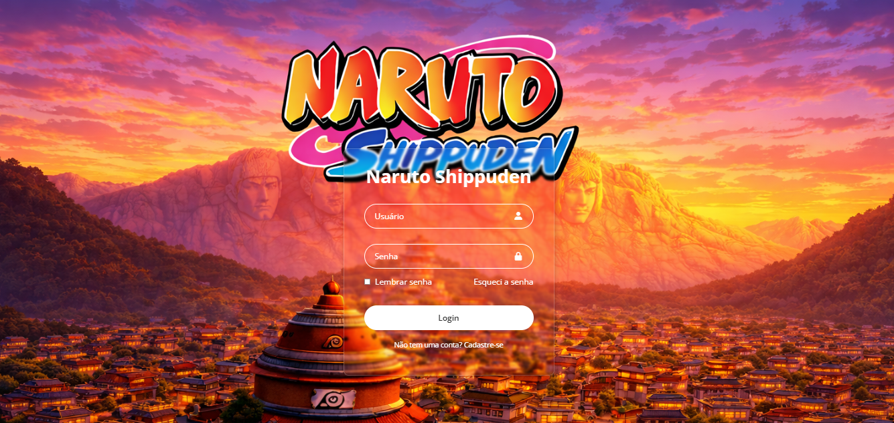

<h1 align="center">🍥 Tela de Login - Naruto Shippuden</h1>

  Uma tela de login temática inspirada no universo de Naruto Shippuden

  <a href="#-tecnologias">Tecnologias</a>&nbsp;&nbsp;&nbsp;|&nbsp;&nbsp;&nbsp;
  <a href="#-projeto">Projeto</a>&nbsp;&nbsp;&nbsp;|&nbsp;&nbsp;&nbsp;
  <a href="#-layout">Layout</a>

  

---

## 🚀 Tecnologias

Esse projeto foi desenvolvido com as seguintes tecnologias:

- HTML
- CSS
- Git e GitHub

---

## 💻 Projeto

Este projeto consiste em uma tela de login estilizada com tema do anime Naruto Shippuden.

A proposta foi praticar conceitos de:

- Estruturação com HTML
- Estilização com CSS (layout e efeitos)
- Organização de projeto para portfólio

---

## 🎨 Layout

O design foi inspirado no universo de Naruto, com foco em uma interface moderna e visual atrativo.

---

## 📌 Observações

Este é um projeto de estudo com fins educacionais.

---

## 🧑‍💻 Autor

Feito por **Leonardo Nascimento** 🚀
